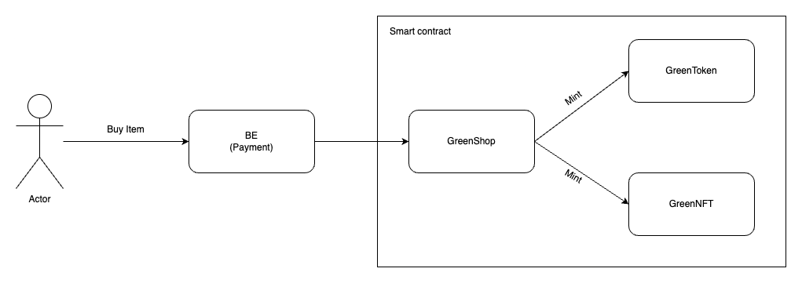

# GreenShop Contracts Repo

## Introduction

Our e-commerce platform specializes in providing users with a curated selection of green products and services.

## Architecture

[](./images/GreenShop.png)

## Contracts

The main contracts folder:

- green-nft: NFTs minted by GreenShop when buy green products
- green-token: Token G2E minted GreenShop when buy green products
- green-shop:

## Code standard

ink! is an EDSL based on Rust; therefore, we use clippy and rustfmt to make sure code is in compliance with Rust idioms.

```
rustup component add rustfmt --toolchain nightly
cargo +nightly fmt
cargo clippy
```

## Contract Build and Deploy Instructions

Before building your smart contract on Aleph Zero, you will first need to install some development tools. The comprehensive guide can be found at:
https://docs.alephzero.org/aleph-zero/build/installing-required-tools

Go to the contract folder you want to build under **contracts** and run

```
cargo +nightly contract build
```

or if you want to build the release version

```
cargo +nightly contract build --release
```

After the contract is built successfully, You will see under target/ink 3 files: **contract_name.wasm contract_name.contract and metadata.json**. Follow this instruction to deploy the contract:
https://docs.alephzero.org/aleph-zero/build/deploying-your-contract-to-aleph-zero-testnet

## Contract Deployment Steps

1. Deploy Green Token Contract
2. Deploy Green NFT Contract
3. Deploy Green Shop Contract
